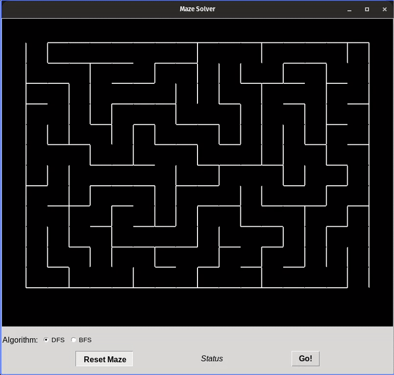

# maze-solver
This is a guided project on building a maze solver with a visual interface using Python

## ⚙ Setup Instructions

1. Install Python and Git (also if you are on WSL ensure that you have tkinter installed and working):
```bash
sudo apt update
sudo apt install -y git python3 python3-pip
# If you are on WSL install and verify that it works:
sudo apt install -y tk-dev && python3 -m tkinter
```

2. Clone the repository:
```bash
git clone https://github.com/fotis-sofoulis/maze-solver.git
```

3. Run the main file:
```bash
python3 main.py
```

## 🖼️ GUI Preview



The GUI, as shown in the figure above consists of:

* An algorithm selector
* A reset button
* An initiation button, and
* A status message

## 📋 ToDo

1. Implement additional algorithms
